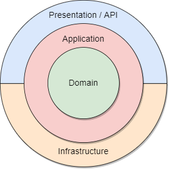
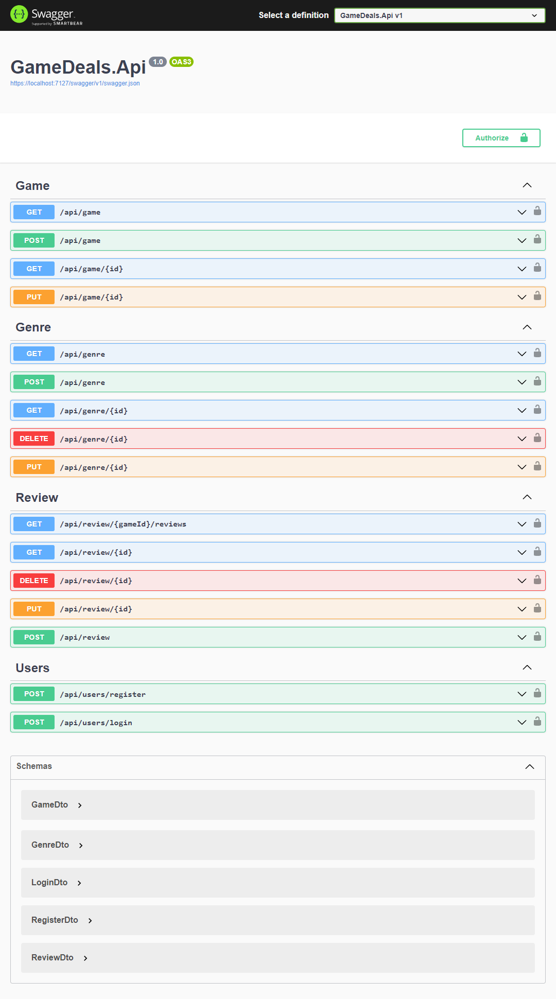

# GameDeals - WebApi do zarządzania grami oraz recenzjami użytkowników

Ten projekt zawiera interfejs REST API, implementujący CRUD (Create-Read-Update-Delete) dla gier, ich kategorii oraz recenzji na ich temat.

Projekt został stworzony przy użyciu następujących technologii:

- ASP.NET Core 7 - framework do tworzenia aplikacji webowych, API oraz usług
- Entity Framework Core - ORM (Object Relational Mapper) do mapowania obiektów na relacyjne bazy danych
- Sqlite - relacyjna baza danych w formie pliku
- Swagger - narzędzie do dokumentowania oraz odpytywania API

Cała solucja aplikacji została podzielona na 4 warstwy, zgodnie z Onion Architecture



- GameDeals.Domain - warstwa domenowa, zawierająca encje domenowe a konkretnie: `Game`, `Genre`, `Review` oraz `User` i `Role` , a także kontrakty do repozytoriów tych encji. Warstwa ta nie zależy od żadnej innej warstwy, nie posiada żadnych zależności na zewnątrz, jest to warstwa najbardziej wewnętrzna.

- GameDeals.Application - warstwa aplikacji, zawierająca interfejsy serwisów aplikacyjnych, a także implementacje tych serwisów, które są wykorzystywane w kontrolerach, aby odseparować repozytoria bazodanowe od modeli przyjmowanych w kontrolerach, stworzony został po prostu kolejny poziom abstrakcji. W tej warstwie znajdują się również modele DTO (Data transfer object) które przyjmują dane przez publiczny interfejs, a poźniej w kolejnym etapie przed wykonywaniem operacji na bazie danych są mapowane na encje domenowe. Warstwa ta zależy od warstwy domenowej, ale już nie jest zależna od żadnych zewnętrznych warstw. W warstwie zawarte zostały również polityki bezpieczeństwa, które są wykorzystywane w kontrolerach, aby zabezpieczyć dostęp do endpointów tylko dla uwierzytelnionych użytkowników systemu. Wyjątkiem sa endpointy, które są publicznie dostępne, jak rejestracja czy logowanie.

- GameDeals.Infrastructure - warstwa infrastruktury, zawiera logikę związaną z bazą danych repozytoria czy DbContext oraz implementację bibliotek zewnętrznych. W tym systemie warstwa ta zawiera implementacje repozytoriów, które są wykorzystywane w serwisach aplikacyjnych. Warstwa ta zależy od warstwy aplikacji, natomiast dziedziczy po warstwie domenowej, ponieważ występuje tutaj dziedziczenie z warstwy aplikacji. Jest warstwą która łączy zewnętrzne zależności z warstwą domenową, ale wykorzystując abstrakcje w warstwie domenowej oraz aplikacji odseparowana została zależność zewnętrznych bytów od zasad bizesowych projektu. Warstwa infrastruktury w głównej mierze służy do komunikacji zewnętrznych zależności, nie związanych bezpośrednio z tematyką biznesową projektu, takich jak baza danych, system plików, czy też zewnętrzne API. W solucji w tej warstwie znajduje się implementacja konfiguracji encji bazodanowych, migracje, database context oraz implementacje repozytoriów, które komunikują się z bazą danych Sqlite przy użyciu Entity Framework Core, a także implementacja serwisu do generowania tokenów JWT, który jest wykorzystywany do uwierzytelniania użytkowników w systemie czy PasswordHasher, który jest wykorzystywany do hashowania haseł użytkowników, podczas dodawania ich do bazy danych.

- GameDeals.API - warstwa API, zawiera kontrolery, które są odpowiedzialne za obsługę żądań HTTP, które są wysyłane do API. W tej warstwie znajduje się również konfiguracja Swaggera, który jest wykorzystywany do dokumentowania API oraz do testowania endpointów, z implementacją uwierzytelniania przy pomocy tokena JWT (Json Web Token). Warstwa ta zależy od warstwy aplikacji przez dziedziczenie z warstwy infrastruktury, ponieważ wykorzystuje serwisy aplikacyjne, które są wykorzystywane w kontrolerach. Warstwa ta jest warstwą najbardziej zewnętrzną, ponieważ jest to warstwa, która jest widoczna dla użytkowników systemu, gdyż to tutaj są wystawione endpointy, które są wykorzystywane przez aplikacje klienckie, aby komunikować się z API. Warstwa ta jest bezpośrednio zależna tylko od warstwy infrastruktury. Zaimplementowany tutaj został również globalny system obsługi błędów, który jest wykorzystywany w kontrolerach, aby zwracać odpowiednie kody błędów HTTP, w zależności od tego, jaki błąd wystąpił w systemie, oraz aby aplikacja nie została zatrzymana przez nieobsłużony wyjątek.

## Instalacja / Uruchomienie aplikacji

Aby uruchomić aplikacje będziesz potrzebował Visual Studio, w wersji 2022 oraz ASP.NET Core Runtime 7.0.
Użyj narzędzia `git`, aby sklonować repozytorium i otworzyć je w programie Visual Studio.

```powershell
    git clone <link_do_repozytorium>
```

Możesz zmodyfikować połączenie do bazy danych, należy w sekcji w pliku appsettings.json, sekcja "ApplicationDatabase" podać odpowiednią wartosć, natomiast jest to aplikacja w pliku więc jest to po prostu nazwa pliku bazy danych która zostanie stworzona automatycznie podczas startu projektu, dlatego nie wymaga to żadnej konfiguracji. Natomiast gdyby była taka potrzeba to można zmienić połączenie podając wartość w następującym formacie:

```json
    "ConnectionStrings": {
        "ApplicationDatabase": "Data Source=ApplicationDatabase.db"
  }
```

Kolejnym krokiem jest po prostu w Visual Studio uruchomienie projektu `GameDeals.Api` poprzez naciśnięcie przycisku `F5` lub `Ctrl + F5` aby uruchomić bez debugowania.

Jeśli domyslnie wybranym projektem jest inny niż `GameDeals.Api` to należy zmienić projekt startowy:

- Prawy przycisk myszy na `GameDeals.Api` w oknine Solution Explorer'a -> Set as Startup Project
- Uruchom `F5`

## Funkcjonalności

- `Users`:

  - rejestracja użytkownika - dostępne dla wszystkich użytkowników
  - logowanie użytkownika - dostępne dla wszystkich użytkowników

- `Genre`

  - dodawanie nowej kategorii gier (dostępne tylko przez Administratora)
  - usuwanie kategorii gier (dostępne tylko przez Administratora)
  - edycja kategorii gier (dostępne tylko przez Administratora)
  - przeglądanie kategorii gier (dostępne po zalogowaniu)
  - przeglądanie kategorii po identyfikatorze (dostępne po zalogowaniu)

- `Game`
  - dodawanie nowej gry (dostępne tylko przez Administratora)
  - edycja gry (dostępne tylko przez Administratora)
  - przeglądanie gier (dostępne po zalogowaniu)
  - przeglądanie gry po identyfikatorze (dostępne tylko po zalogowaniu)
  - nie przewidziano funkcjonalności usuwania dodanych gier

- `Review`
  - dodawanie nowej recenzji (dostępne tylko dla zalogowanych użytkowników)
  - edycja recenzji (dostępne po zalogowaniu)
  - przeglądanie recenzji dla gry (dostępne po zalogowaniu)
  - podgląd recenzji po identyfikatorze (dostępne po zalogowaniu)



## API

W aplikacji zostało zaimplementowane Rest API wraz z autoryzacją `Bearer Token`

API dostępne pod adresem `https://localhost:7127/`
Swagger dostępny pod adresem `https://localhost:7127/swagger/index.html`

- Kategorie gier - `api/Genre/`
- Gry - `api/Game/`
- Recenzje - `api/Review/`
- Użytkownicy - `api/Users/`

### Przyklad użycia na przykładzie zasobu `Game`

|Ścieżka      | Metoda  |  Opis |
|-------------|:-------:|-------|
|api/Game/  | GET     |Zwraca listę wszystkich gier|
|api/Game/  | POST    |Dodawanie konkretnej gry, autogenerowane pole ID|
|api/Game/1 | GET     |Zwraca jedną grę według pola Id|
|api/Game/1 | PUT     |Aktualizacja gry po polu Id|
